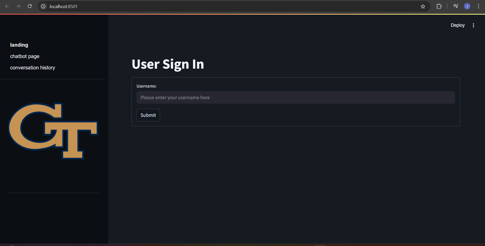
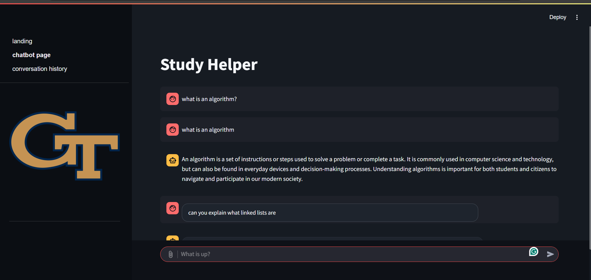
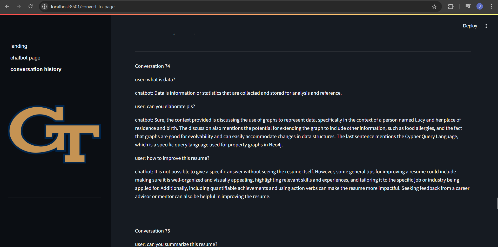

## Efficient Study

### Goal

### Data Preparation and Setup

Database Design:
1. Postgres for storing basic application info (i.e. users, messages, conversations, etc.). You should have both PostgreSQL (https://www.postgresql.org/download/) and PGAdmin (https://www.pgadmin.org/download/) downloaded. We use Postgres v16. Before you start the application, open up PGAdmin and keep it open for the duration of the project.
2. Mongo for storing documents. Simply use the pymongo library to start using as we have provided in the requirements.txt file.
3. Vector Databases that help with delivering tailored responses. Simply use the FAISS, LangChain, and OpenAI libraries as we have provided in the requirements.txt file.

We provide an example textbook to use when chatting with the bot ("Designing Data Intensive Applications.pdf")

### Application and code

Below are all libraries in the requirements.txt file along with their importance:

1. `streamlit`: Used to run our Streamlit application
2. `langchain-community`: Used to help preprocess documents, create embeddings, and generate answers to user questions
3. `openai`: Used to call OpenAI API
4. `chromadb`: Used to create our vector DB to store the embeddings?
5. `tiktoken`: Used to manage token limits when working with OpenAI API
6. `pymupdf`:Helps in preprocessing the pdf document the user uploads
7. `python-dotenv` : Used to help load secret environment variable, like OpenAI API key
8. `faiss-cpu`: Used to create our vector DB to store the embeddings
9.  `psycopg2-binary`: Library to connect to our PostgreSQL DB
10. `pymongo`: Library to connect to our MongoDB
11.  `gridfs`: Used to store files in PostgreSQL DB
12. `requests`: Allows us to send HTTP requests

Below are some steps to run our application:

1. `git clone https://github.com/VineethNareddy/EfficientStudy.git`: Use this command to clone the repo in your IDE
2. `pip install -r requirements.txt`: To install all libraries used in the project. Should take ~5 min if you never installed the libraries in the requirements.txt file before
3. PostgreSQL installation: You should have both PostgreSQL (https://www.postgresql.org/download/) and PGAdmin (https://www.pgadmin.org/download/) downloaded. We use Postgres v16. Before you start the application, open up PGAdmin and keep it open for the duration of the project.
4. `psql -U {input username} -d {input database name} -f db.sql`: This creates database tables
5. Create a .env folder and have the following variables: OpenAI API key (you will have to get this by yourself), HOST (localhost), DATABASE (your database name), USER (your username), PASSWORD (your password)
6. `streamlit run main.py`: To launch our application. Should take a short time before a user can finally interact with our application.
7. You have to create a username before you continue using the app. Otherwise, this may cause errors
8. In addition, your first chat must include a file attached to it. Otherwise, this may also cause errors

Note: It's best if you run this app with the latest version of Python installed. We're not sure of this, but if you don't have the latest version, any version >= 3.12 should work.

### Code Documentation and References

1. `https://github.com/dataprofessor/langchain-ask-the-doc`: This repo helped our team understand the architecture behind what we are trying to build and serves as a foundation for the backend.

2. `https://docs.streamlit.io/develop/tutorials/chat-and-llm-apps/build-conversational-apps`: This is to help build the chat functionality. We used the code from the Build a ChatGPT-like clone section I believe. We significantly changed the code section after the line "prompt := st.chat_input..." 

